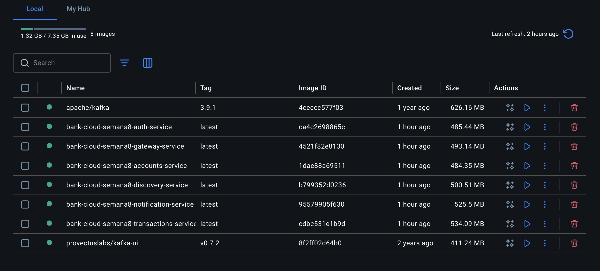
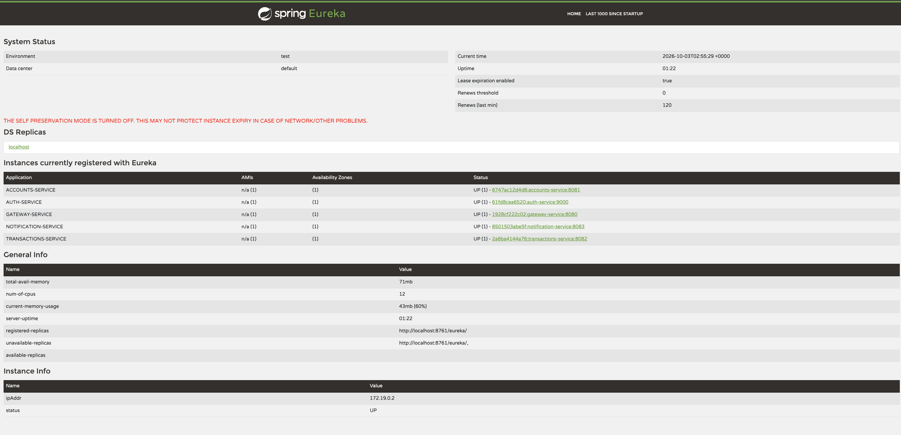
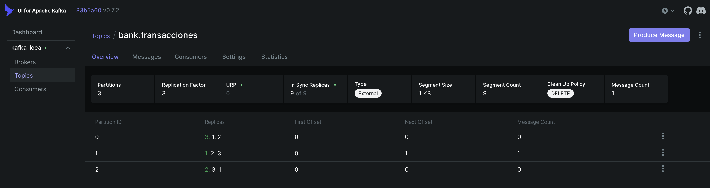

# Banco XYZ — microservicios y resiliencia en la nube

Actividad sumativa: desarrollar microservicios y resiliencia en la nube con Spring Cloud, tomando como datos base el legado de [bank_legacy_data](https://github.com/KariVillagran/bank_legacy_data).

## Objetivo

Exponer la información histórica del Banco XYZ (cuentas, intereses y transacciones) mediante microservicios independientes, protegidos con OAuth 2.0, tolerantes a fallos y comunicados de forma asíncrona. El sistema se levanta completo con Docker Compose.

## Propuesta técnica

La solución separa el acceso, la seguridad y el negocio:

- **discovery-service** registra los microservicios con Eureka para que el gateway los encuentre por nombre.
- **auth-service** es el servidor de autorización. Emite JWT con el grant `client_credentials`.
- **gateway-service** es la única entrada HTTP. Rechaza peticiones sin token y aplica un circuit breaker por ruta.
- **accounts-service** carga `intereses.csv` y `cuentas_anuales.csv`. Cada fila queda marcada como válida o con sus observaciones (saldo vacío, edad fuera de rango, tipo inválido, duplicados).
- **transactions-service** carga `transacciones.csv`, publica eventos en Kafka y consulta el resumen de cuentas. Si cuentas no responde, Resilience4j devuelve el informe solo con las transacciones.
- **notification-service** consume el topic `bank.transacciones` y conserva los últimos eventos.
- **Kafka** corre con 3 brokers. El topic `bank.transacciones` tiene 3 particiones y replicación 3, así cada mensaje queda copiado en los tres brokers. Transporta la importación del CSV y cada transacción nueva.

Los CSV de `data/semana_1`, `data/semana_2` y `data/semana_3` se copian dentro de las imágenes. El perfil por defecto es `semana_3`.

El cliente de demostración es `bank-client` / `bank-secret`, con los scopes `accounts.read`, `transactions.read`, `transactions.write` y `events.read`. `transactions-service` usa un segundo cliente, `transactions-internal`, solo para leer cuentas. Esas claves son de la entrega, no de un ambiente real.

## Estructura

```
bank-cloud-semana8/
├── pom.xml                      # proyecto Maven multi-módulo
├── Dockerfile                   # una etapa de imagen por microservicio
├── docker-compose.yml           # Eureka, OAuth2, Kafka y los servicios
├── data/                        # CSV legacy por semana
├── common/                      # lectura de CSV, fechas y el evento de Kafka
├── discovery-service/           # Eureka, puerto 8761
├── auth-service/                # OAuth 2.0, puerto 9000
├── accounts-service/            # cuentas, puerto 8081
├── transactions-service/        # transacciones, Resilience4j y productor Kafka, puerto 8082
├── notification-service/        # consumidor Kafka, puerto 8083
├── gateway-service/             # entrada y circuit breaker, puerto 8080
└── CAPTURAS/                    # evidencia de ejecución
```

Stack: Java 21, Spring Boot 3.5, Spring Cloud 2025.0, Resilience4j, Kafka y Docker.

## Cómo ejecutarlo

Requisitos: JDK 21 o superior, Maven 3.9 y Docker.

```bash
docker compose up --build
```

Las imágenes generadas para cada microservicio quedan en Docker:



Para compilar y probar sin contenedores:

```bash
mvn test
```

### Token manual

```bash
curl -u bank-client:bank-secret \
  -d grant_type=client_credentials \
  -d scope="accounts.read transactions.read transactions.write events.read" \
  http://localhost:9000/oauth2/token
```


### Rutas

Todas pasan por el gateway (`http://localhost:8080`) y piden `Authorization: Bearer <token>`.

| Método | Ruta | Scope |
| --- | --- | --- |
| GET | `/api/cuentas` y `/api/cuentas?soloValidas=true` | `accounts.read` |
| GET | `/api/cuentas/resumen` | `accounts.read` |
| GET | `/api/cuentas/{id}` y `/api/cuentas/{id}/anual` | `accounts.read` |
| GET | `/api/transacciones` y `/api/transacciones/{id}` | `transactions.read` |
| GET | `/api/transacciones/informe` | `transactions.read` |
| POST | `/api/transacciones` | `transactions.write` |
| GET | `/api/eventos` | `events.read` |

Ejemplo de alta:

```bash
curl -H "Authorization: Bearer $TOKEN" -H "Content-Type: application/json" \
  -d '{"fecha":"2024-12-02","monto":2200,"tipo":"debito"}' \
  http://localhost:8080/api/transacciones
```

Para ver el corte de Resilience4j, con el sistema arriba:

```bash
docker compose stop accounts-service
```

`GET /api/cuentas` responde el fallback del gateway. `GET /api/transacciones/informe` sigue entregando las transacciones con `cuentasDisponibles` en falso. Después se vuelve a levantar cuentas con `docker compose start accounts-service`.

## Evidencia de ejecución

### Cada microservicio en ejecución

Eureka muestra los cinco microservicios registrados y en estado UP: cuentas, autorización, gateway, notificaciones y transacciones.



Arranque de cada microservicio:

```
Tomcat started on port 8761
Started DiscoveryServiceApplication in 2.245 seconds

Tomcat started on port 9000
Started AuthServiceApplication in 1.884 seconds

Tomcat started on port 8081
Started AccountsServiceApplication in 2.953 seconds

Tomcat started on port 8082
Started TransactionsServiceApplication in 4.029 seconds

Tomcat started on port 8083
Started NotificationServiceApplication in 3.243 seconds

Netty started on port 8080
Started GatewayServiceApplication in 2.144 seconds
```

Servicios registrados en Eureka: `ACCOUNTS-SERVICE`, `AUTH-SERVICE`, `GATEWAY-SERVICE`, `NOTIFICATION-SERVICE`, `TRANSACTIONS-SERVICE`.

Salud de cada uno (`/actuator/health`): `{"status":"UP"}`.

Token OAuth 2.0 (`POST /oauth2/token`):

```
token_type: Bearer
expires_in: 3599
scope: accounts.read transactions.read transactions.write events.read
```

Sin token, el gateway responde `401`.

Resumen de cuentas (`GET /api/cuentas/resumen`):

```json
{"disponible":true,"totalRegistros":1000,"cuentasValidas":17,"saldoTotal":162000,"mensaje":"ok"}
```

Informe que cruza transacciones y cuentas (`GET /api/transacciones/informe`):

```json
{"totalRegistros":1000,"transaccionesValidas":401,"montoTotal":527000,"cuentasDisponibles":true,"cuentas":{"disponible":true,"totalRegistros":1000,"cuentasValidas":17,"saldoTotal":162000,"mensaje":"ok"},"mensaje":"Informe completo"}
```

Alta publicada en Kafka (`POST /api/transacciones`, HTTP 201):

```json
{"transaccion":{"id":1001,"fechaOriginal":"2024-12-02","fecha":"2024-12-02","monto":2200,"tipo":"debito","valida":true,"observaciones":[]},"eventoPublicado":true}
```

El topic `bank.transacciones` quedó con 3 particiones y replicación 3. Cada partición tiene réplica en los brokers 1, 2 y 3.



Eventos consumidos (`GET /api/eventos`):

```json
[
  {"tipoEvento":"TRANSACCION_CREADA","transaccionId":1001,"tipoMovimiento":"debito","monto":2200,"fecha":"2024-12-02","detalle":"Transacción registrada"},
  {"tipoEvento":"IMPORTACION","monto":527000,"detalle":"Importación legacy: 1000 transacciones"}
]
```
